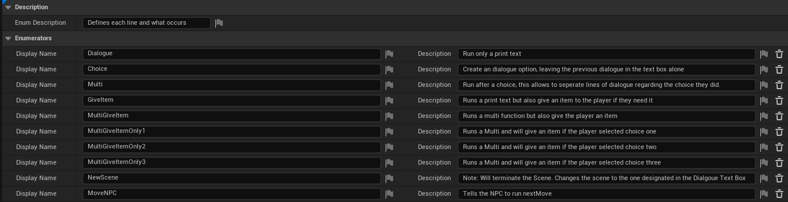

# Mechanics created for Awesome Black's Video Game
Below is a deep dive into my thought process for each major mechanic I created. If your interested to get an understanding of most of the mechanics in a video form <a href="https://youtu.be/O8pYdZHz7CY">click here</a>

### Dialogue
Dialogue System handled everything that occured the second the Dialogue showed on screen to the moment it disappeared. 

##### Storing Each line
> Note: Due to the prototype stage it is in I couldn't go onto my next step of moving structures into datatables using the structures formed.

Using Structures it was easy enough to store all possible information for each seperate line. An array of these structures would be what consists a character dialogue. 

 

Not all variables in the structure are needed to be filled in but determined by the Dialogue Type selected certain parts of the Structure would need to be filled in. 

Inside the NextLine Function the structure is called and all information is expanded for easy use without having to search multiple different variables. 

###### Dialogue Types
> Note: With further time I would of liked to explore the ability to only have certain parts of the Structure show up determined by which structure you selected.

Dialogue Types was a Enumarator created to store a collection of options that would changed what occured for that line. 
IE this can be moving an NPC, giving the ability to choose dialogue, printing out dialogue if you meet a certain logic.

 

Inside the system, the nextLine function would use a switch statement of the enumerator to determine what would occur next. As you can with this image, that showcases the Switch Statement, the plain text output and part of what the dialogue option dsiplay option.

 

#### Dialogue TextHandler
Dialogue TextHandler is the function that handles all the stuff that is centered with the dialogue text in the event graph. In the nextLine Fuction it is called whenever needed for a Dialogue Type. Below is an example of this for a just a plain printing of text.

 

Inside the TextHanler there are three main areas of the system. The beginnning saves and resets of Variables and style of the Text box, The per loop changes, and the Mark Up reader.

The **Save and Reset** is where different variables are set back to their default settings and modified for the function. There is nothing to highlight here.

The **Per Loop Changes** is where there are checks for any Markup appearing, checks if it needs to speed up dialogue printing, and runs any changes per character.

The **Markup Reader** is a section that breaks off from the flow of the loop, if there appears a '<' in the next character to be printed. The Markup Reader area grabs the full text inside the markup `<happy>` and then another function handles verifying that the markup actually exists. 

 

A Markup is an identifier for a style or an effect change that wants to be occured. This was usually used to either highlight specific words or to emphasize the emotions of the player at that time.

##### Dialogue Customization
With the game being a narratively driven game a focus on bringing to life the characters the players interacted with. This done through the use of creating personality through the text that represented them. From basic things like the color that is used to display their name to the picture that represents them to more specific things like how differently we show their emotions or how fast or slow they may speak (through speed of printing out the text). All of this to create indiviuality through the dialogue. 

This is all mainly stored withone the Name Structure. A Structure that holds all information about a Character. 

 
> Note in the future it was planned to create all this in a single DataTable that could be called from by an ID.

With this data it could change the appearance of text either in the nextLine Function or as a default in the TextHandler Function (Defaults are what appears if no Markup is effecting the text).

### Interaction System
The interaction System is what handles both what occurs when you press the interact button but the different things that you can interact with and how those react when you move close to them.

Inside the game at the current stage there was the following types of interactables
 1. interactableNPC (This is also used as a Child Actor for all moveableNPCs to handle interactions) 
 2. ObjectDialogue (Similar to NPCs that have specific Object rules)
 3. InteractableObjects (No event other then Pick Up occurs)

Without needing to create nests of Casts that would need to be updated each time a new type of interactable was added into the game the use of Interfaces was brought in.

Instead of figuring out what type of Class the object was to trigger an event I instead used interfaces, as I could call the function inside of the Interface and if that Class had the function it would trigger it. Reducing the need for Casting and repeatedly adding onto the main check function. 

#### Area Events
To allow to notify the player when objects were near or when you could interact with an object. A system was created to notify Objects to run certain events:
- InRangeObject (If the object is inside a check Radius run this function)
- ClosestObject (When the object is inside the players reach and was the closest one to the player)
- OutOfRange (If no longer in range of player)
- NotClosestObject (When the player is still close to the object but it either has moved outside the reachable range or it is not the closest object anymore)

These events were triggered by overlapping with either the reachableCollisionBox or the SearchRangeCollisionBox.

With the check for the reachableCollision being the more complex as it needs to identify which object is the closest to the object and will then be selected if the player prseses the interact button that exact tick. This is done by comparing distance vectors between each object and the player.

#### Interaction Event
Handles triggering the object that is closest to the player in its reachable distance. Using Interfaces the eacfh type of Interactable can has it own custom code that is triggered if the InteractedWith Function is called.
